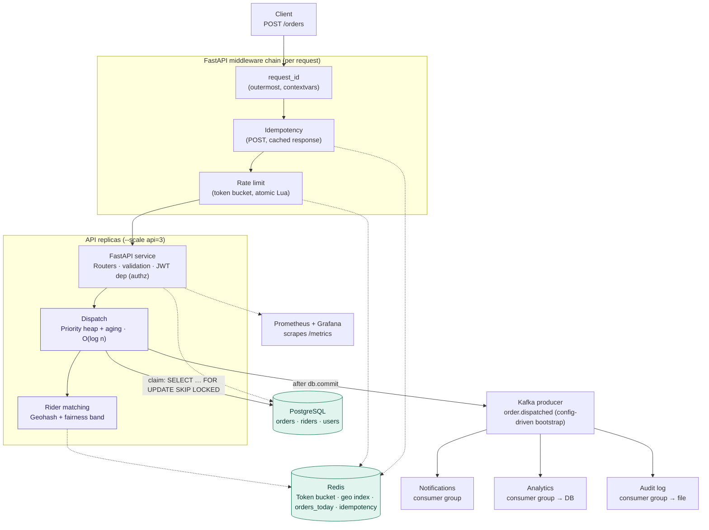

# DeliverIQ

> Scalable order dispatch API with priority queuing, geohash-based
> rider matching, and token-bucket rate limiting.
> Built with FastAPI · PostgreSQL · Redis · Docker.

**What makes it different:** fairness-aware dispatch — within a bounded distance
band it balances rider earnings, not just ETA, reframing greedy-nearest as a
constrained assignment problem.

## Architecture

## Learning Plan
Following a structured 45-day roadmap → [View Plan](docs/PLAN.md)
##
And for SQL [View Plan](docs/SQL.md)
##
And for Interview Notes [Notes](docs/Interview_prep.md)
##
And for Resources (youtube links or official docs) [resources](docs/All_Resources_in_One_Place.md)

## Stack
- Python · FastAPI
- PostgreSQL · SQLAlchemy
- Redis
- Docker + docker compose
