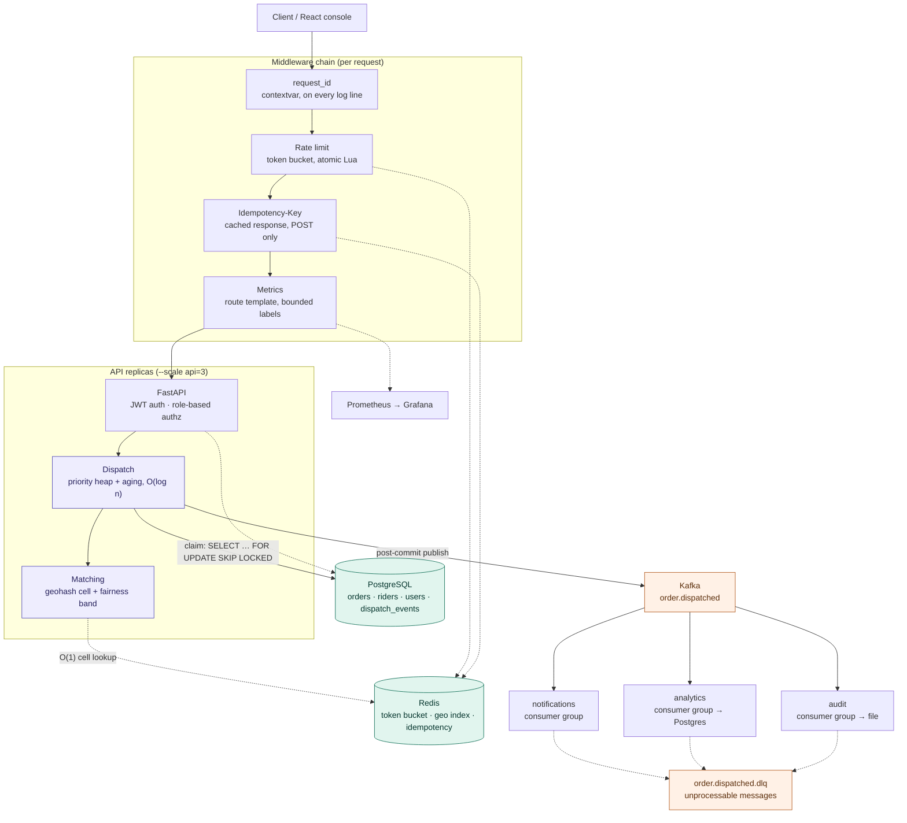

# DeliverIQ

> Distributed order dispatch service — priority-queued assignment with
> fairness-aware rider matching, event streaming, and production hardening.
>
> **FastAPI · PostgreSQL · Redis · Kafka · Docker · Prometheus/Grafana · React**

Orders arrive continuously. Riders are scarce, mobile, and contested by multiple
API replicas at once. DeliverIQ decides *which order goes to which rider* without
double-assigning either, publishes that decision as a durable event, and stays
correct when its dependencies fail.

**What makes it different:** dispatch is treated as a constrained assignment
problem rather than greedy-nearest. Within a bounded distance band the service
balances rider *earnings*, so the closest rider does not take every order while
others idle — throughput inside an SLA, distributed fairly.

---

## Architecture


```mermaid
flowchart TD
    Client["Client / React console"]

    subgraph MW["Middleware chain (per request)"]
        ReqID["request_id<br/>contextvar, on every log line"]
        RL["Rate limit<br/>token bucket, atomic Lua"]
        Idem["Idempotency-Key<br/>cached response, POST only"]
        Met["Metrics<br/>route template, bounded labels"]
    end

    subgraph REPLICAS["API replicas (--scale api=3)"]
        API["FastAPI<br/>JWT auth · role-based authz"]
        Dispatch["Dispatch<br/>priority heap + aging, O(log n)"]
        Match["Matching<br/>geohash cell + fairness band"]
    end

    Postgres[("PostgreSQL<br/>orders · riders · users · dispatch_events")]
    Redis[("Redis<br/>token bucket · geo index · idempotency")]
    Kafka["Kafka<br/>order.dispatched"]
    DLQ["order.dispatched.dlq<br/>unprocessable messages"]
    Obs["Prometheus → Grafana"]

    Notif["notifications<br/>consumer group"]
    Analytics["analytics<br/>consumer group → Postgres"]
    Audit["audit<br/>consumer group → file"]

    Client --> ReqID --> RL --> Idem --> Met --> API
    API --> Dispatch
    Dispatch -->|"claim: SELECT … FOR UPDATE SKIP LOCKED"| Postgres
    Dispatch --> Match
    Match -.->|"O(1) cell lookup"| Redis
    Dispatch -->|"post-commit publish"| Kafka
    RL -.-> Redis
    Idem -.-> Redis
    API -.-> Postgres
    Met -.-> Obs
    Kafka --> Notif
    Kafka --> Analytics
    Kafka --> Audit
    Notif -.-> DLQ
    Analytics -.-> DLQ
    Audit -.-> DLQ

    classDef algo fill:#EEEDFE,stroke:#534AB7,color:#26215C;
    classDef store fill:#E1F5EE,stroke:#0F6E56,color:#04342C;
    classDef bus fill:#FFF1E6,stroke:#B25A1E,color:#5C2F0C;
    class Dispatch,Match algo;
    class Redis,Postgres store;
    class Kafka,DLQ bus;
```

---

## Quick start

Requires Docker and Docker Compose. Nothing else — the React bundle is built
inside the image.

```bash
git clone https://github.com/Shoryagg7/deliveriq && cd deliveriq
cp .env.example .env
docker compose up -d --build

# demo logins + a populated board
docker compose exec api python -m scripts.seed_users
docker compose exec api python -m scripts.seed_demo
```

| | |
|---|---|
| Console | http://localhost:8000 |
| API docs | http://localhost:8000/docs |
| Grafana | http://localhost:3000/d/deliveriq-main |
| Prometheus | http://localhost:9090 |
| Kafka UI | http://localhost:8080 |

**Demo logins.** Roles cannot be self-assigned — registration always creates a
customer, and promotion is an operator action.

| Login | Password | Can do |
|---|---|---|
| `ops@deliveriq.io` | `opspassword123` | dispatch, onboard riders, any status change, `/admin/stats` |
| `rider@deliveriq.io` | `riderpassword123` | advance only orders assigned to them; never cancel |
| `customer@deliveriq.io` | `custpassword123` | place orders; 403 on everything above |

---

## Core design decisions

### Dispatch under concurrency — two-phase claim
Three API replicas race for the same pending orders. Each dispatch claims the
order row *and* the rider row with `SELECT … FOR UPDATE SKIP LOCKED` before
mutating anything: contenders skip locked rows instead of blocking, so a
contested dispatch degrades into a retry rather than a deadlock. Losing a rider
mid-claim re-selects the next-best rider for the *same* order rather than
dropping the order. Verified with concurrent dispatches across replicas — zero
duplicate order or rider assignments.

### Matching — O(1) lookup, bounded search
Riders are indexed into geohash cells in Redis (precision 6, ~1.2 km × 0.61 km).
Matching reads the order's cell plus its eight neighbours — constant time
regardless of fleet size, versus scanning every rider. The trade-off is explicit:
a rider more than one cell out is not considered. Within the candidate set a
500 m fairness band admits everyone near the closest rider, then picks whoever
has taken the fewest orders today.

### Scheduling — priority with aging
A max-heap orders by `value + minutes_waited × weight`, so high-value orders go
first but nothing starves: a cheap order that has waited long enough outranks a
fresh expensive one.

### Events — at-least-once with a dead-letter path
Dispatch publishes `order.dispatched` **after** commit, keyed by `order_id` so a
single order's events stay ordered. Three consumer groups read the same topic
independently — `notifications`, `analytics` (writes Postgres), `audit` (appends
a file) — each with its own committed offsets, so one consumer failing or falling
behind cannot affect the others, and a new group replays history from the start.

Consumers commit **after** processing, which makes delivery at-least-once. Two
consequences are handled rather than assumed:

- **Duplicates.** The analytics consumer deduplicates on `(partition, offset)`
  with `ON CONFLICT DO NOTHING`, so redelivery is a no-op. Delivery stays
  at-least-once; the *effect* becomes exactly-once.
- **Poison messages.** A message that can never be processed would otherwise
  wedge its partition forever and block every valid event queued behind it —
  invisibly, since a partition with no committed offset reports no lag.
  Unprocessable messages go to a DLQ with full context, and the offset advances
  only once that publish is acknowledged.

### Failure behaviour
- `/health` is liveness — cheap, zero dependencies. `/ready` round-trips
  Postgres, Redis and Kafka and returns 503 naming the failure. They are separate
  because a liveness probe that depends on Redis turns one cache blip into an
  orchestrator restarting the entire fleet.
- The rate limiter **fails open**: a protective control must not cause the outage
  it exists to prevent. For an auth or payment control the trade-off inverts.
- Workers handle `SIGTERM` and leave their consumer group cleanly. Without it,
  every `docker compose stop` stalls the replacement for `session.timeout.ms`
  (~45 s, measured).
- The Redis geohash index is derived state, and `scripts/reindex_riders.py`
  rebuilds it from Postgres — otherwise a flushed Redis leaves every rider
  invisible to dispatch with no error raised anywhere.

---

## API

| Method | Path | Auth |
|---|---|---|
| `POST` | `/auth/register` · `/auth/login` | public |
| `GET` | `/auth/me` | authenticated |
| `POST` `GET` | `/orders` | public |
| `GET` | `/orders/{id}` | public |
| `POST` | `/orders/dispatch` | **ops** |
| `PATCH` | `/orders/{id}/status` | **ops**, or the assigned rider |
| `POST` | `/riders` | **ops** |
| `GET` `PATCH` | `/riders/{id}` · `/riders/{id}/location` | public |
| `GET` | `/admin/stats` | **ops** |
| `GET` | `/health` · `/ready` · `/metrics` | public |

Status transitions pass two orthogonal guards: the move must be **legal**
(`PENDING → DELIVERED` is not) *and* the caller must be **permitted** — a
customer marking their own order delivered is a legal move by the wrong actor,
which a state machine alone cannot catch.

`POST /orders` accepts an `Idempotency-Key` header; a retry with the same key
replays the original response instead of creating a second order.

---

## Observability

Prometheus scrapes `/metrics`; Grafana loads a dashboard provisioned from the
repo, so `docker compose down -v` cannot lose it.

Metrics are chosen for what an on-call engineer would page on: request rate,
error rate, latency histograms, dependency status, Kafka published-vs-delivered,
rate-limit rejections, idempotent replays, and dispatch outcomes labelled
`assigned` / `no_pending_orders` / `no_rider_available` — a supply problem and a
demand problem need opposite responses.

Route labels use the **route template** (`/orders/{order_id}`), never the raw
path, which would mint one time series per order id forever.

Logs are structured JSON carrying a `request_id` correlated across the request.

---

## Testing

```bash
docker compose up -d db redis kafka
docker compose up kafka-init --exit-code-from kafka-init
alembic upgrade head
pytest -q
```

Tests run against real Postgres, Redis and Kafka rather than mocks, covering the
dispatch lifecycle, the state machine, authentication, the per-role
authorization matrix, and idempotent retries.

Kafka publishing is patched at the **call sites**: every module that did
`from … import publish_event` holds its own binding, so patching the definition
site leaves the real function in place — the test passes and the event still
reaches the broker. The fixture records calls, so publishing is asserted rather
than merely silenced, and fails if any code path constructs a real producer.

CI runs lint, migrations and the full suite on every push, bringing up
infrastructure from the same `docker-compose.yml` used locally so the two cannot
drift.

---

## Load

Locust, 50 concurrent users, rate limiter disabled: **~123 RPS, p99 220 ms, 0%
errors**. With the limiter enabled, throughput is capped by the bucket by design
— worth naming which configuration a number came from.

---

## Project layout

```
app/
  core/        config · security · metrics · enums · kafka producer
  middleware/  request_id · rate limit · idempotency · metrics
  models/      SQLAlchemy models
  routers/     orders · riders · auth · admin
  services/    dispatch · geohash matching · order state machine
  workers/     shared consumer runner + notification/analytics/audit
frontend/      React console (built into the API image)
ops/           Prometheus config · provisioned Grafana dashboard
scripts/       seeding · rider reindex · concurrency test
tests/
```

## Stack

Python 3.14 · FastAPI · SQLAlchemy · Alembic · PostgreSQL 18 · Redis 7 ·
Apache Kafka 4.1 (KRaft) · Docker Compose · Prometheus · Grafana · React (Vite) ·
pytest · Ruff · GitHub Actions
