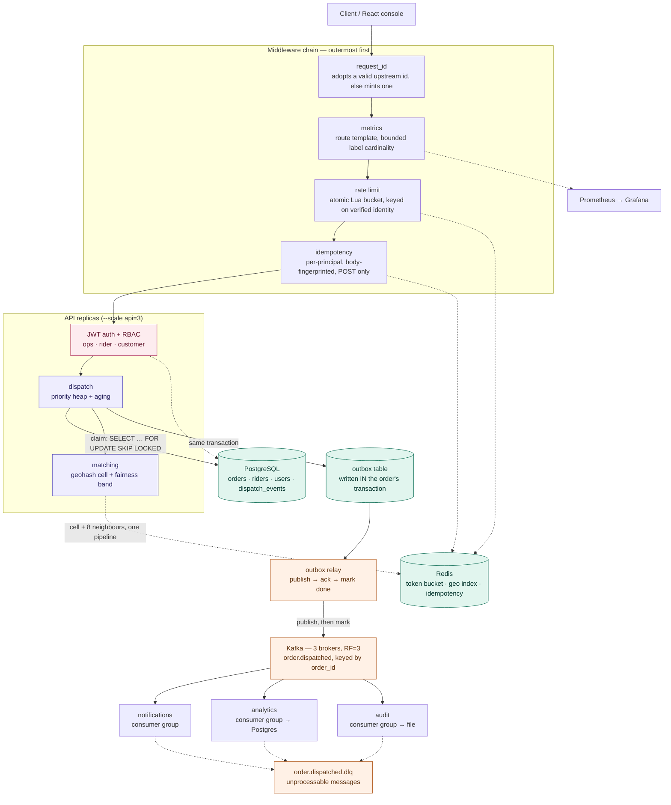

# DeliverIQ

> Distributed order dispatch service — priority-queued assignment with
> fairness-aware rider matching, event streaming, and production hardening.
>
> **FastAPI · PostgreSQL · Redis · Kafka · Docker · Prometheus/Grafana · React**

Orders arrive continuously. Riders are scarce, mobile, and contested by multiple
API replicas at once. DeliverIQ decides *which order goes to which rider* without
double-assigning either, publishes that decision as a durable event, and stays
correct when its dependencies fail.

**What makes it different:** dispatch is treated as a constrained assignment
problem rather than greedy-nearest. Within a bounded distance band the service
balances rider *earnings*, so the closest rider does not take every order while
others idle — throughput inside an SLA, distributed fairly.

---

## Architecture


```mermaid
flowchart TD
    Client["Client / React console"]

    subgraph MW["Middleware chain — outermost first"]
        ReqID["request_id<br/>adopts a valid upstream id, else mints one"]
        Met["metrics<br/>route template, bounded label cardinality"]
        RL["rate limit<br/>atomic Lua bucket, keyed on verified identity"]
        Idem["idempotency<br/>per-principal, body-fingerprinted, POST only"]
    end

    subgraph REPLICAS["API replicas (--scale api=3)"]
        Auth["JWT auth + RBAC<br/>ops · rider · customer"]
        Dispatch["dispatch<br/>priority heap + aging"]
        Match["matching<br/>geohash cell + fairness band"]
    end

    Postgres[("PostgreSQL<br/>orders · riders · users · dispatch_events")]
    Redis[("Redis<br/>token bucket · geo index · idempotency")]
    Outbox[("outbox table<br/>written IN the order's transaction")]
    Relay["outbox relay<br/>publish → ack → mark done"]
    Kafka["Kafka — 3 brokers, RF=3<br/>order.dispatched, keyed by order_id"]
    DLQ["order.dispatched.dlq<br/>unprocessable messages"]
    Obs["Prometheus → Grafana"]

    Notif["notifications<br/>consumer group"]
    Analytics["analytics<br/>consumer group → Postgres"]
    Audit["audit<br/>consumer group → file"]

    Client --> ReqID --> Met --> RL --> Idem --> Auth
    Auth --> Dispatch
    Dispatch -->|"claim: SELECT … FOR UPDATE SKIP LOCKED"| Postgres
    Dispatch --> Match
    Match -.->|"cell + 8 neighbours, one pipeline"| Redis
    Dispatch -->|"same transaction"| Outbox
    Outbox --> Relay
    Relay -->|"publish, then mark"| Kafka
    RL -.-> Redis
    Idem -.-> Redis
    Auth -.-> Postgres
    Met -.-> Obs
    Kafka --> Notif
    Kafka --> Analytics
    Kafka --> Audit
    Notif -.-> DLQ
    Analytics -.-> DLQ
    Audit -.-> DLQ

    classDef algo fill:#EEEDFE,stroke:#534AB7,color:#26215C;
    classDef store fill:#E1F5EE,stroke:#0F6E56,color:#04342C;
    classDef bus fill:#FFF1E6,stroke:#B25A1E,color:#5C2F0C;
    classDef sec fill:#FDECEF,stroke:#A61E4D,color:#5C0F26;
    class Dispatch,Match algo;
    class Redis,Postgres store;
    class Kafka,DLQ,Relay bus;
    class Outbox store;
    class Auth sec;
```

**Reading the middleware chain.** Order is deliberate and each position is load-
bearing. `request_id` is outermost so every log line — including a 429 — carries
a trace id. `metrics` sits next so it observes *every* response the service
emits, including rate-limit rejections and idempotent replays that never reach a
route. `rate_limit` precedes `idempotency` so a flood of replayed keys is still
throttled.

---

## Quick start

Requires Docker and Docker Compose. Nothing else — the React bundle is built
inside the image.

```bash
git clone https://github.com/Shoryagg7/deliveriq && cd deliveriq
cp .env.example .env

# JWT_SECRET has no default — the app refuses to start without one, by design
sed -i "s|^JWT_SECRET=.*|JWT_SECRET=$(python3 -c 'import secrets; print(secrets.token_urlsafe(48))')|" .env

docker compose up -d --build          # first build ~4 min; subsequent ~15 s

# demo logins + a populated board
docker compose exec api python -m scripts.seed_users
docker compose exec api python -m scripts.seed_demo
```

Confirm every dependency answered before using the console:

```bash
curl -s localhost:8000/ready | python3 -m json.tool
# {"status": "ready", "checks": {"postgres": "ok", "redis": "ok", "kafka": "ok"}}
```

| | |
|---|---|
| Console | http://localhost:8000 |
| API docs | http://localhost:8000/docs |
| Grafana | http://localhost:3000/d/deliveriq-main |
| Prometheus | http://localhost:9090 |
| Kafka UI | http://localhost:8080 |

**Demo logins.** Roles cannot be self-assigned — registration always creates a
customer, and promotion is an operator action.

| Login | Password | Can do |
|---|---|---|
| `ops@deliveriq.io` | `opspassword123` | dispatch, onboard riders, any status change, `/admin/stats` |
| `rider@deliveriq.io` | `riderpassword123` | advance only orders assigned to them; never cancel |
| `customer@deliveriq.io` | `custpassword123` | place orders; 403 on everything above |

---

## Core design decisions

### Dispatch under concurrency — two-phase claim
Three API replicas race for the same pending orders. Each dispatch claims the
order row *and* the rider row with `SELECT … FOR UPDATE SKIP LOCKED` before
mutating anything: contenders skip locked rows instead of blocking, so a
contested dispatch degrades into a retry rather than a deadlock. Losing a rider
mid-claim re-selects the next-best rider for the *same* order rather than
dropping the order. Verified with concurrent dispatches across replicas — zero
duplicate order or rider assignments.

### Matching — bounded search, then fairness
Riders are indexed into geohash cells in Redis (precision 6, ~1.2 km × 0.61 km).
Matching reads the order's cell plus its eight neighbours: a constant number of
set lookups regardless of fleet size, versus scanning every rider. Scoring the
candidates is then linear in how many riders occupy those nine cells, so the win
is *bounding the candidate set*, not constant-time end to end — the honest claim
is the useful one. Candidate reads are issued as a single Redis pipeline, because
this runs while a Postgres row lock is held and every round trip is lock-hold
time.

The trade-off is explicit: a rider more than one cell out is not considered.
Within the candidate set a 500 m fairness band admits everyone near the closest
rider, then picks whoever has taken the fewest orders today.

### Scheduling — priority with aging
A max-heap orders by `value + minutes_waited × weight`, so high-value orders go
first but nothing starves: a cheap order that has waited long enough outranks a
fresh expensive one.

### Events — a transactional outbox, then at-least-once delivery
Dispatch does **not** publish to Kafka. It writes the event as a row in an
`outbox` table **inside the same transaction** as the order and the rider, so one
commit covers all three — closing the dual-write hole where a crash between
`db.commit()` and a publish lost the event forever. A relay
(`app/workers/outbox_relay.py`) then publishes those rows and marks them done, in
that order: marking first would move the same hole one layer down. The trade is
explicit — the event is durable but no longer instant.

Events are keyed by `order_id` so a single order's events stay ordered. Three consumer groups read the same topic
independently — `notifications`, `analytics` (writes Postgres), `audit` (appends
a file) — each with its own committed offsets, so one consumer failing or falling
behind cannot affect the others, and a new group replays history from the start.

Consumers commit **after** processing, which makes delivery at-least-once. Two
consequences are handled rather than assumed:

- **Duplicates.** The analytics consumer deduplicates on `(partition, offset)`
  with `ON CONFLICT DO NOTHING`, so redelivery is a no-op. Delivery stays
  at-least-once; the *effect* becomes exactly-once.
- **Poison messages.** A message that can never be processed would otherwise
  wedge its partition forever and block every valid event queued behind it —
  invisibly, since a partition with no committed offset reports no lag.
  Unprocessable messages go to a DLQ with full context, and the offset advances
  only once that publish is acknowledged.

### Security — audited, not assumed
The service was audited endpoint by endpoint after it was feature-complete, and
the audit found more than the feature work had: four endpoints reachable with no
token at all, a signing key with a working default, and an idempotency cache that
could serve one user another user's response. All are closed.

- **Identity is derived, never accepted.** `POST /orders` takes `customer_id`
  from the verified token; the field was removed from the request schema
  entirely. A field the server must validate against the token is a field the
  client should not be sending.
- **Reads are scoped in the query, not filtered after.** A customer's listing
  never loads another customer's row. `GET /orders/{id}` answers **404** for an
  order you may not see, because a 403 would confirm the id exists and allow
  enumeration — while `PATCH /riders/{id}/location` authorises *before* the
  existence check for the same reason in reverse. Which fact is worth hiding
  decides the code.
- **Rider location is a dispatch-integrity endpoint.** It writes through to the
  geohash index, so whoever can move riders can steer assignment. It is guarded
  like the dispatch path, not like a profile update.
- **`JWT_SECRET` has no default.** The app refuses to import without one, rejects
  known placeholders, and requires 32 bytes. A control that can be skipped by
  forgetting an environment variable is not a control.
- **Rate limiting keys on verified identity**, falling back to `X-Forwarded-For`
  only when a trusted proxy is declared. Keying on a caller-supplied header let
  anyone mint a fresh bucket per request.

`./scripts/verify.sh` re-checks all of this in one command, including minting a
token with the old shipped secret and asserting the API rejects it.

### Failure behaviour
- `/health` is liveness — cheap, zero dependencies. `/ready` round-trips
  Postgres, Redis and Kafka and returns 503 naming the failure. They are separate
  because a liveness probe that depends on Redis turns one cache blip into an
  orchestrator restarting the entire fleet.
- The rate limiter **fails open**: a protective control must not cause the outage
  it exists to prevent. For an auth or payment control the trade-off inverts.
- Workers handle `SIGTERM` and leave their consumer group cleanly. Without it,
  every `docker compose stop` stalls the replacement for `session.timeout.ms`
  (~45 s, measured).
- The Redis geohash index is derived state, and `scripts/reindex_riders.py`
  rebuilds it from Postgres — otherwise a flushed Redis leaves every rider
  invisible to dispatch with no error raised anywhere.

---

## API

| Method | Path | Auth |
|---|---|---|
| `POST` | `/auth/register` · `/auth/login` | public |
| `GET` | `/auth/me` | authenticated |
| `POST` | `/orders` | authenticated — owner taken from the token |
| `GET` | `/orders` · `/orders/{id}` | authenticated — scoped by role |
| `POST` | `/orders/dispatch` | **ops** |
| `PATCH` | `/orders/{id}/status` | **ops**, or the assigned rider |
| `POST` `GET` | `/riders` | **ops** |
| `GET` `PATCH` | `/riders/{id}` · `/riders/{id}/location` | **ops**, or that rider |
| `GET` | `/admin/stats` | **ops** |
| `GET` | `/health` · `/ready` · `/metrics` | public |

Read scoping is per role: ops sees everything, a rider sees only orders assigned
to them, a customer sees only their own.

Status transitions pass two orthogonal guards: the move must be **legal**
(`PENDING → DELIVERED` is not) *and* the caller must be **permitted** — a
customer marking their own order delivered is a legal move by the wrong actor,
which a state machine alone cannot catch.

`POST /orders` accepts an `Idempotency-Key` header; a retry with the same key
replays the original response instead of creating a second order. The key is
namespaced per authenticated caller and bound to a hash of the request, so two
users cannot collide on the same key and the same key sent with a *different*
body returns 422 rather than a confidently wrong replay.

---

## Observability

Prometheus scrapes `/metrics`; Grafana loads a dashboard provisioned from the
repo, so `docker compose down -v` cannot lose it.

Metrics are chosen for what an on-call engineer would page on: request rate,
error rate, latency histograms, dependency status, Kafka published-vs-delivered,
rate-limit rejections, idempotent replays, and dispatch outcomes labelled
`assigned` / `no_pending_orders` / `no_rider_available` — a supply problem and a
demand problem need opposite responses.

Route labels use the **route template** (`/orders/{order_id}`), never the raw
path, which would mint one time series per order id forever.

Logs are structured JSON carrying a `request_id` correlated across the request.

---

## Testing

One command runs everything — config guards, lint, the suite, and a live smoke
test of every auth boundary against a real server:

```bash
./scripts/verify.sh
```

It is safe to run alongside a live stack: the suite uses a separate
`deliveriq_test_db`, so development data is untouched.

Or drive the suite directly:

```bash
docker compose up -d db redis kafka
docker compose up kafka-init --exit-code-from kafka-init
alembic upgrade head
pytest -q                                    # 71 tests
```

**71 tests**, of which 47 are integration — they run against real Postgres and
Redis rather than mocks, covering the dispatch lifecycle, the state machine,
authentication, the per-role authorization matrix, read scoping, and idempotent
retries. The remaining 24 are unit tests over configuration validation and the
middleware key-derivation helpers, which are pure functions and do not need
infrastructure to be worth testing.

| File | Covers |
|---|---|
| `test_orders.py` | order lifecycle, dispatch, state machine, idempotent retries |
| `test_auth.py` | registration, login, the authn-vs-authz split, actor guards |
| `test_scoping_and_idempotency.py` | per-role read scoping, cross-tenant key isolation |
| `test_rider_location_auth.py` | the dispatch-integrity guard, including a hijack attempt |
| `test_middleware_hardening.py` | rate-limit keying, request-id adoption, metrics coverage |
| `test_config.py` | the `JWT_SECRET` startup guard |

Kafka publishing is patched at the **call sites**: every module that did
`from … import publish_event` holds its own binding, so patching the definition
site leaves the real function in place — the test passes and the event still
reaches the broker. The fixture records calls, so publishing is asserted rather
than merely silenced, and fails if any code path constructs a real producer.

CI runs lint, migrations and the full suite on every push, bringing up
infrastructure from the same `docker-compose.yml` used locally so the two cannot
drift.

---

## Load

The previous figure measured unauthenticated `POST /orders` — a plain INSERT, no
matching, locking or Kafka — so it was retired. Pointing the load profile at the
**dispatch claim** instead found a real defect in one run: with a large backlog
and no free riders, every call scanned the entire pending set to answer "nobody
is available".

Same host, 50 users, 60 s, limiter off, 3 replicas — before and after bounding
that scan:

| dispatch claim | RPS | p50 | p95 | p99 | max |
|---|---|---|---|---|---|
| unbounded scan | 9.3 | 1700 ms | 8200 ms | 11000 ms | 17000 ms |
| bounded to top 20 | 14.3 | 1600 ms | 2300 ms | **2800 ms** | 3100 ms |

**Read these as a comparison, not a capacity number.** API, Postgres, Redis and
three Kafka brokers share one laptop, so the absolute figures describe the
machine. What is valid is that one variable changed and p99 fell 4×: a
single-host benchmark is near-worthless for capacity and excellent for
regression.

Reproduce:

```bash
RATE_LIMIT_ENABLED=false API_PORTS=8000-8002:8000 docker compose up -d --scale api=3
docker compose exec api python -m scripts.seed_users
locust -f locustfile.py --host http://localhost:8000 --headless -u 50 -r 10 -t 60s
```

Always name which configuration *and which endpoint* a load number came from.
With the limiter enabled, throughput is capped by the bucket by design — that
measures the limiter, not the app.

---

## Notes

`docs/INTERVIEW_NOTES.md` explains the stack choices — what each component is,
why it was chosen, and what was rejected — plus deep dives on rate-limiting
algorithms, Redis, auth/JWT, and Kafka's delivery semantics. `docs/INTERVIEW_PREP.md` is the long
form. `docs/DAILY_COMMANDS.md` is the operational runbook.

---

## Project layout

```
app/
  core/        config · security · metrics · enums · kafka producer
  middleware/  request_id · rate limit · idempotency · metrics
  models/      SQLAlchemy models (orders, riders, users, outbox, events)
  routers/     orders · riders · auth · admin
  services/    dispatch · geohash matching · order state machine
  workers/     outbox relay + shared consumer runner (notification/analytics/audit)
frontend/      React console (built into the API image)
ops/           Prometheus config · provisioned Grafana dashboard
scripts/       seeding · rider reindex · concurrency test · verify.sh
tests/
```

## Stack

Python 3.14 · FastAPI · SQLAlchemy · Alembic · PostgreSQL 18 · Redis 7 ·
Apache Kafka 4.1 (KRaft, 3 brokers, RF=3) · Docker Compose · Prometheus · Grafana · React (Vite) ·
pytest · Ruff · GitHub Actions
